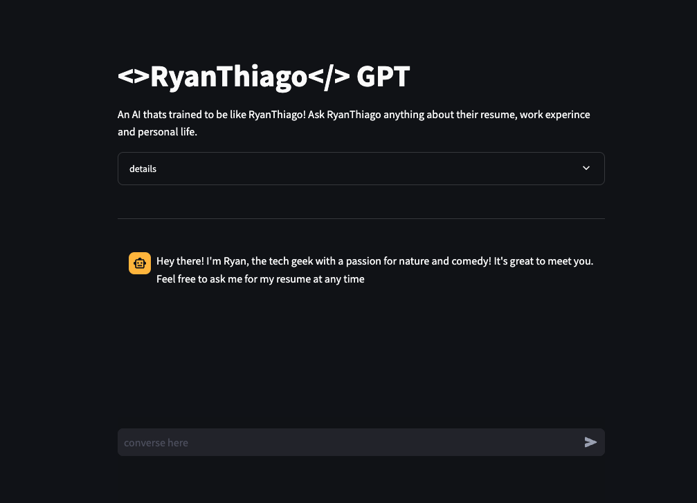

# YourName-GPT

An AI thats trained to be like you! Ask YourName anything about their resume, work experince and personal life. 


**TLDR: This repo enables you to create a AI version of yourself to talk too:**
1. A recuiter
2. Clients
3. Anyone who wants to get to know you

## About
The purpose of `YourName-GPT` is to serve as your own personal AI chatbot. This chatbot can answer mock interview questions on your behalf by retrieving the infomation you provide to it. Its composed of a libray built on top of [LangChain](https://docs.langchain.com/docs/) and the original source code [data-driven-characters](https://github.com/mbchang/data-driven-characters) by [Micheal Chang](https://twitter.com/mmmbchang?ref=blog.langchain.dev) the real [MVP](https://media.giphy.com/media/v1.Y2lkPTc5MGI3NjExeWpieG5yMDZiMGozb3g5YmUzcGprYmlta3AxMTIyajZoY2V3eWM4MCZlcD12MV9pbnRlcm5hbF9naWZfYnlfaWQmY3Q9Zw/GVMhZwYv8U5NK/giphy.gif) whom which 
This project was inpsired from. Check out the [Langchain blog post](https://blog.langchain.dev/data-driven-characters/#:~:text=data%2Ddriven%2Dcharacters%20is%20a%20repo%20for%20creating%20and%20interacting,existing%20platforms%20like%20character.ai.) for infomation about the original project. 
This project can process any resume in text format and any text body of work as the personal information. The project will create your character definition, manage conversation memory, and provide a UI to interact with your personal chabot powered by OpenAi's Chat GPT. 


## Installation
To install the YourName GPT package, you need to clone the repository and install the dependencies.

You can clone the repository using the following command:

```bash
git clone <change this>
```
Then, navigate into the cloned directory:

```bash
cd YourName-GPT
```
Make sure python installed (at least 3.9.6) to play it safe make sure you have at least that version. If not, you can download it from the [official Python website](https://www.python.org/downloads/release/python-396/).

You Install the package and its dependencies with:

```bash
pip install -r requirements.txt
```
# Setup Instructions
The following is needed to interact with the UI
##### Creating a `.streamlit` folder

1. Open your terminal.

2. Navigate to the root directory of your project using the `cd` command:

    ```bash
    cd path_to_YourName-GPT
    ```

    Replace `path_to_your_project` with the actual path to your project.

3. Create a new folder named `.streamlit`:

    ```bash
    mkdir .streamlit
    ```

##### Creating a `secrets.toml` file

1. In the `.streamlit` folder, create a new file named `secrets.toml`:

    ```bash
    touch .streamlit/secrets.toml
    ```

2. Open the `secrets.toml` file in a text editor.

3. Add your secrets to the `secrets.toml` file in the TOML format. For example, if you want to store an OpenAI API key, you can do it like this:

    ```toml
    OPENAI_API_KEY = "your_openai_api_key"
    ```

    Replace `"your_openai_api_key"` with your actual OpenAI API key. for instructions on how to get API key look [here](https://help.openai.com/en/articles/4936850-where-do-i-find-my-api-key) 

4. Save the `secrets.toml` file.
## **Important**
Please note that you should not commit the `secrets.toml` file to your Git repository, especially if your repository is public. To prevent this, you can add `.streamlit/secrets.toml` to your `.gitignore` file.

# Streamlit Interface

Example command:

```
python -m streamlit run chat.py
```

This produces a UI that looks like this:
 


## Adding your own data
In order for the AI to create your character you'll need to enter the contents of your resume and whole life story (kidding) into the data/resume.txt file

```bash

RESUME:

"your resume in text format here"

PERSONAL INFO:

"your personal info here"

```

then run the following command with your name.

```bash
python -m streamlit run chat.py -- --character_name <YourNameHere>
```
It may take some time the first time it runs a new name since its creating all the summaries that will make up your AI (video explaining this [here](https://youryoutubevideo))

thats it enjoy!


## Contributing
pull requests are needed lol I built this as best as I could. For major changes, please open an issue first to discuss what you would like to change.

## License
[MIT](LICENSE)
